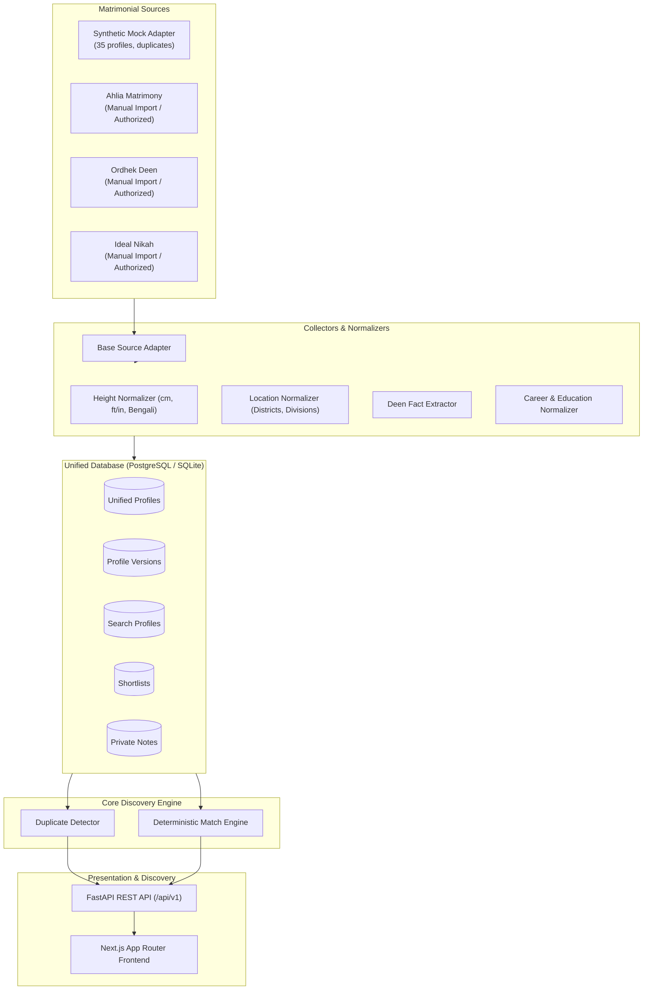

# NikahLens

> **Privacy-Conscious Matrimonial Profile Discovery Engine**  
> *A smarter, transparent, and ethical way to discover, filter, and review matrimonial candidates.*

---

## 1. Overview

**NikahLens** is an open-source, privacy-first matrimonial profile discovery engine. 

Most matrimonial and dating platforms reduce candidates to misleading single "compatibility percentages" (e.g. "87% compatible") and force subjective judgments. NikahLens was built from the ground up on a different set of principles:

- **Complete Transparency**: Every search result details **why** it appeared and highlights **information gaps** that require human review.
- **Deterministic Filtering**: Cleanly separates hard requirements (`REQUIRED`, `EXCLUDED`) from soft preferences (`PREFERRED`, `OPTIONAL`).
- **Ethical & Fact-Based**: Religious and career information are presented factually with source evidence citations. We never label candidates as "pious", "good", or "financially established".
- **Privacy by Design**: Zero credential scraping, no CAPTCHA bypassing, no unauthorized automated contact, and strictly private local notes.

---

## 2. Key Features

- **Transparent Match Categories**:
  - `Strong Match`: All hard requirements met with extensive positive alignment.
  - `Potential Match`: Hard requirements met with soft preference trade-offs.
  - `Needs Review`: Information gaps (e.g. unstated height, unverified stability).
  - `Hard Requirement Not Met`: Required criteria out of bounds.
- **Multi-Attribute Deen Extraction**: Salah, Quran recitation/memorization, Sunnah beard, Islamic studies, and Halal income are independently tracked with evidence types (`self_reported` vs `verified`).
- **Objective Career Modeling**: Distinguishes stated occupations from unverified financial status without inferring wealth from job titles.
- **Normalization Utilities**: Converts varied formats for height (feet/inches, cm, Bengali digits), locations (Bengali & English districts), ages, education, and professions.
- **Duplicate Detection**: Identifies cross-posted profiles across multiple sources using multi-attribute heuristic signals with confidence scores (`High`, `Medium`, `Low`).
- **Review Pipeline**: Manage candidate review stages: `New`, `Interesting`, `Shortlisted`, `Need Review`, `Contact Later`, and `Archived`.
- **Private Notes**: Local-only notes that are never sent to external source platforms.
- **Synthetic Mock Dataset**: Includes 35 high-fidelity synthetic profiles covering Rangpur, northern Bangladesh districts, cross-posted duplicates, and edge cases.

---

## 3. Architecture



---

## 4. Tech Stack

- **Frontend**: Next.js 16 (App Router), React 19, TypeScript, Tailwind CSS, Lucide Icons
- **Backend**: Python 3.11+, FastAPI, Pydantic v2, SQLAlchemy 2.0, Uvicorn
- **Database**: PostgreSQL 16 (Docker Compose) / SQLite (zero-config local dev)
- **Migrations**: Alembic
- **Testing**: pytest, httpx TestClient

---

## 5. Project Structure

```text
nikah-lens/
│
├── apps/
│   ├── web/                    # Next.js App Router frontend
│   └── api/                    # FastAPI backend REST API
│
├── services/
│   ├── collectors/             # Source adapters (Mock, Ahlia, Ordhek Deen, Ideal Nikah)
│   ├── normalizer/             # Height, age, location, education, profession, deen
│   ├── matcher/                # Deterministic match engine
│   └── deduplicator/           # Cross-source duplicate detector
│
├── packages/
│   ├── schemas/                # Shared Pydantic domain models
│   └── utils/                  # Common utilities
│
├── database/
│   ├── models.py               # SQLAlchemy ORM models
│   ├── session.py              # DB engine & session management
│   ├── seed/                   # Synthetic mock seeding
│   └── migrations/             # Alembic migration scripts
│
├── docs/                       # Architecture, data policy, source policy, dev guides
├── tests/                      # Pytest unit & integration test suite
├── docker-compose.yml          # PostgreSQL development service
├── .env.example                # Environment variable configuration template
├── pyproject.toml              # Python build and package configuration
├── README.md                   # Project documentation
└── LICENSE                     # Open source license
```

---

## 6. Getting Started

### 1. Clone & Set Environment
```bash
git clone https://github.com/rushdv/nikah-lens.git
cd nikah-lens
cp .env.example .env
```

### 2. Database & Migrations
Default configuration uses SQLite (`sqlite:///./nikah_lens.db`). For PostgreSQL via Docker:
```bash
docker compose up -d
```

Run migrations and seed the 35 synthetic candidates:
```bash
# Run migrations
alembic -c database/migrations/alembic.ini upgrade head

# Seed synthetic mock profiles
python database/seed/seed_data.py
```

### 3. Start Backend API
```bash
uvicorn apps.api.main:app --host 0.0.0.0 --port 8000 --reload
```
API Documentation: `http://localhost:8000/docs`

### 4. Start Frontend
```bash
cd apps/web
pnpm install
pnpm dev
```
Web Application: `http://localhost:3000`

---

## 7. Running Tests

Run the complete test suite:
```bash
pytest tests/
```

All 27 unit & integration tests verify:
- Height normalizations (feet/inches, cm, Bengali digits)
- Location canonicalization (Rangpur division and Bangladesh districts)
- Deterministic MatchEngine (hard requirements, soft preferences, unknown handling)
- Duplicate detection scoring and reasoning
- Mock adapter profile generation
- REST API endpoints (profiles, search, saved searches, shortlists, notes, sources)

---

## 8. Source Adapter System & Compliance

NikahLens enforces strict compliance with matrimonial platform terms and privacy expectations:
- **Mock Adapter**: Active by default. Generates 35 realistic synthetic candidates with zero real personal data.
- **Ahlia, Ordhek Deen, Ideal Nikah Adapters**: Live automated web scraping is disabled by default. These adapters operate exclusively in manual-import or authorized-API modes.

For details, see [docs/source-policy.md](docs/source-policy.md).

---

## 9. Privacy & Data Policy

- No bypassing of access controls, paywalls, or CAPTCHAs.
- No automated contact or messaging to candidates.
- Zero subjective appraisals ("pious", "good", "wealthy").
- Strictly local private notes.

For details, see [docs/data-policy.md](docs/data-policy.md).

---

## 10. Roadmap

- **Phase 1**: Initial production foundation with mock data, deterministic matcher, and UI **(Completed)**
- **Phase 2**: Real source adapters where officially permitted
- **Phase 3**: Advanced semantic normalization
- **Phase 4**: Advanced machine-assisted duplicate resolution
- **Phase 5**: AI-assisted profile interpretation
- **Phase 6**: Natural language search
- **Phase 7**: Automated profile change detection
- **Phase 8**: Authentication & multi-user workspaces

---

## 11. License

Licensed under the MIT License. See [LICENSE](LICENSE) for details.
