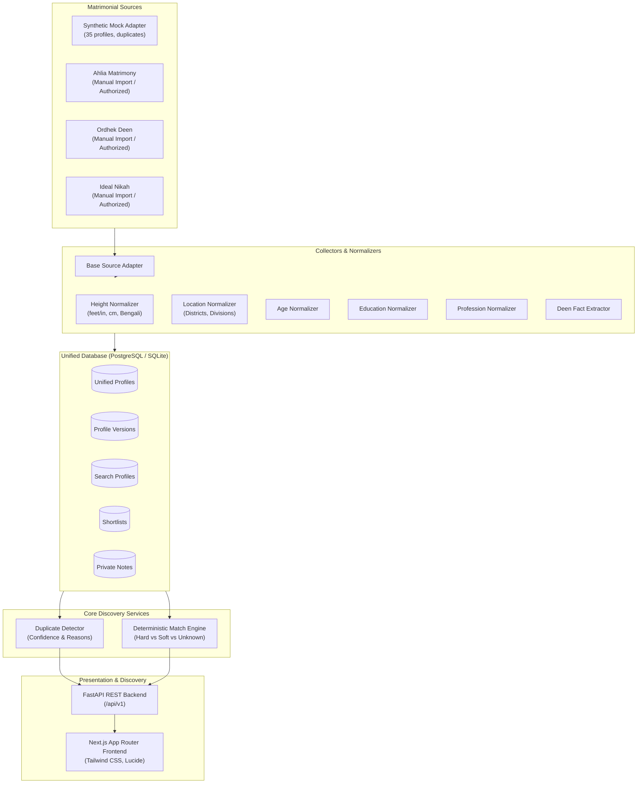

# NikahLens Architecture

## 1. Overview & Architectural Philosophy

NikahLens is an ethical, privacy-conscious matrimonial profile discovery and search engine designed to help individuals evaluate matrimonial profiles methodically, transparently, and objectively.

Unlike typical dating or matrimonial apps that provide opaque "87% compatibility" percentages, NikahLens operates on **deterministic matching** with complete explainability:
- Distinguishes **hard requirements** (`REQUIRED`, `EXCLUDED`) from **soft preferences** (`PREFERRED`, `OPTIONAL`).
- Classifies results into transparent tiers: **Strong Match**, **Potential Match**, **Needs Review**, and **Hard Requirement Not Met**.
- Explains exactly **why** a profile appeared and highlights **information gaps** (unstated or unverified data).
- Decouples subjective judgments: avoids labelling people as "pious", "good", or "wealthy", and strictly presents stated facts with evidence citations.

---

## 2. End-to-End Discovery Pipeline

---

## 3. Core Modules & Separation of Concerns

### A. Source Adapters (`services/collectors/`)
Each source implements `BaseSourceAdapter` and is independently toggleable:
- Declares its operational mode (`mock`, `manual_import`, `public_api`, `disabled`).
- Declares compliance with source terms of service and robots directives.
- Zero credential leakage.
- Automated unauthenticated scraping is strictly disabled if unauthorized.

### B. Normalization Layer (`services/normalizer/`)
Converts noisy, multilingual matrimonial data into canonical, queryable representations while preserving original raw values:
- **Height**: Converts feet/inches (`5'7"`, `5 feet 7 inches`), centimeters (`170.2 cm`), and Bengali numerals (`৫ ফুট ৭ ইঞ্চি`) to centimeters.
- **Location**: Maps Bengali (`রংপুর`, `দিনাজপুর`) and English strings (`Rangpur Sadar`, `Dhaka City`) to canonical districts.
- **Deen Information**: Structures religious attributes (Salah, Quran, Beard, Studies, Halal Income) with evidence types (`self_reported`, `verified`) and stated status (`stated`, `not_stated`, `unknown`).
- **Career & Stability**: Standardizes roles and categories without assuming wealth or financial stability from job titles.

### C. Match Engine (`services/matcher/`)
- Deterministic logic without black-box machine learning for filtering.
- Distinguishes `MATCH`, `NO_MATCH`, and `UNKNOWN`. Missing data does not automatically disqualify candidates unless explicitly requested.
- Generates human-readable `why_matched` bullet points and `needs_review` information gaps.

### D. Duplicate Detection (`services/deduplicator/`)
Identifies cross-posted profiles across multiple sources using multi-attribute heuristic signals (age, height, district, study field, profession). Assigns confidence levels (`High`, `Medium`, `Low`) and explicit matching reasons.

### E. Shortlist & Private Notes (`database/models.py`)
Provides review stages:
1. `New`
2. `Interesting`
3. `Shortlisted`
4. `Need Review`
5. `Contact Later`
6. `Archived`

Private notes are strictly local to the user database and never transmitted to external services.
